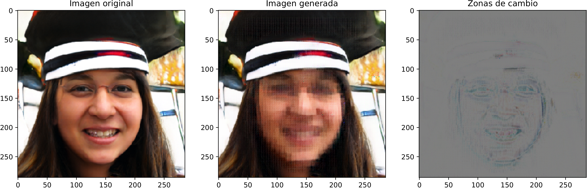
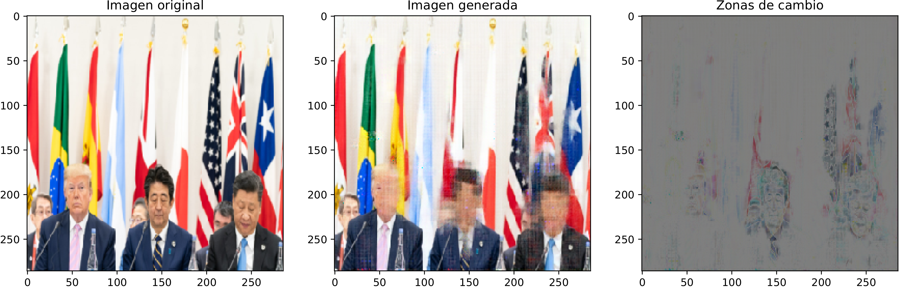

# pix2pix2pixel
## Resumen.
Implementación en PyTorch de la arquitectura Pix2Pix siguiendo el [artículo original](https://arxiv.org/pdf/1611.07004.pdf).

Esta implementación se ha utilizado para dar una imagen a la red y que pixele las caras que encuentre. Se ha entrenado también el proceso inverso, en el cual dada una imagen pixelada la red debe reconstruir el rostro.

## Dependencias
- PyTorch
- PIL
- numpy
- matplotlib
- torchvision

## Ficheros
- pix2pix_faces: Ficheros para ejecutar entrenamiento y visualización de resultados.
	- dataloader.py: Clase para cargar datos y ejecutar transformaciones a las imágenes de entrada y salida.
	- model.py: Clases del generador y discriminador, así como función para ejecutar checkpoints. En su mayoría copiado de [este proyecto.](https://github.com/Eiji-Kb/simple-pix2pix-pytorch/blob/master/models.py)
	- train.py: En este fichero se engloba todo... carga las imágenes y ejecuta el entrenamiento.
	- eval.py: Permite evaluar un modelo preentrenado.

- heat_map.ipynb: Notebook para evaluar un modelo entrenado y ver las regiones de mayor diferencia entre la imagen de entrada y salida.
- pixel_faces.ipynb: Más o menos lo mismo que lo que hay en los ficheros en pix2pix_faces pero en Notebook.

## Uso
### Paso 1 - Obtener los datos de entrenamiento.

En el caso de la obtención de imágenes pixeladas se han descagado un total de 183 imágenes de Google y se han pixelado una a una utilizando GIMP. Desde luego, la cantidad de datos de entrenamiento no es muy alta, pero como se verá más abajo los resultados han sido bastante satisfactorios, especialmente en el sentido de pixelar caras, resultado esperable por otro lado.

En cuando a las imágenes seleccionadas se ha intentado encontrar imágenes grupales, retratos y gente de espalda (en cuyo caso la red no debería hacer nada).

Las imágenes se guardan en dos carpetas distintas, teniendo las imágenes pixeladas y las no pixeladas el mismo nombre.

### Paso 2 - Entrenamiento.

Para ejecutar el entrenamiento se debe ejecutar el siguiente comando:

```bash
python train.py --max_epoch=100000 
                --ROOT=../../Images/ 
		--INPUT=no-pixeled 
		--OUTPUT=pixeled 
		--tr_per=0.8
```

Donde ```--tr_per``` es el porcentaje de datos que van al conjunto de entrenamiento, ```--ROOT``` debe ser el directorio que contiene ambas carpetas, ```--INPUT``` el nombre de la carpeta con las imágenes de entrada y ```--OUTPUT``` la carpeta con las imágenes objetivo. En caso de que queramos pixelar caras, ```--INPU
T``` será el directorio a las imágenes sin pixelar la cara y ```--OUTPUT``` el directorio a las imágenes con la cara pixelada.


En caso de querer cargar un modelo para continuar entrenándolo se puede ejecutar:

```bash
python train.py --model=checkpoint.pth 
                --max_epoch=100000 
		--ROOT=../../Images/ 
		--INPUT=no-pixeled 
		--OUTPUT=pixeled 
		--tr_per=0.8
```

Durante el proceso de entrenamiento imprimirá imágenes cada 100 epochs, lo que permite ir visualizando los efectos del entrenamiento. De igual forma, cada 100 epochs guardará un checkpoint, con el nombre "checkpoint.pth".


## Paso 3 - Visualización de resultados.
Lo más interesante para visualizar los resultados es emplear el Notebook "heat_map.ipynb". Siguiendo las intrucciones especificadas en el Notebook  podemos cargar un modelo preentrenado (a través de los ficheros .pth en la carpeta "modelos"), introducir una foto y ver el resultado, dependiendo del sentido en el que hayamos entrenado el modelo la pixelara o despixelará.

#### Pixelar caras

[This person does not exist](https://thispersondoesnotexist.com/)


[Imagen Original](https://www.flickr.com/photos/whitehouse/48144069691)

A parte de ver cómo ha pixelado la imagen podemos veremos una tercera imagen que nos muestra qué zonas se han visto más modificadas, viendo que en general es capaz de solo pixelar la cara (y un poquito de alrededores).

Nota: No puedo subir a GitHub los modelos entrenados pero se pueden obtener durante con el siguiente [link a Drive](https://drive.google.com/open?id=1OF-XhbLZ_YrMYwZJtpjUxiFJ_VBguhOx)
